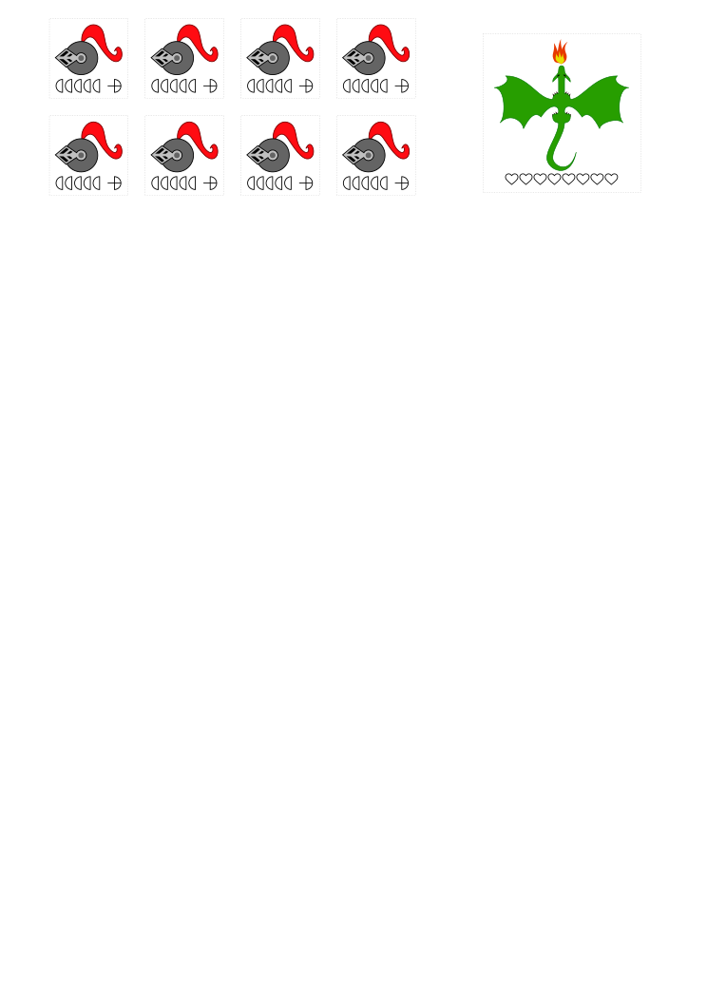

ATG Castle
==========
Occorrente: 1 dado a 6 facce, tabellone castello, personaggi drago e cavalieri

Si gioca in due, un giocatore gioca non i cavalieri, l'altro con in drago

I personaggi possono muoversi nel tabellone orizzontalmente o verticalmente. Non si può passare attraverso gli altri personaggi. I personaggi possono entrare o uscire dal castello tramite il ponte levatoio (marrone) o tramite il passaggio segreto (nero). L'acqua (azzurro) non si può attraversare. Il drago non può utilizzare il passaggio segreto. Non si può attaccare attraverso le mura del castello (bordo grigio scuro).

Svolgimento del turno 
----------------------
Inizia il giocatore con i cavalieri. 

Il giocatore tira un dado, il risultato indica di quante caselle si può muovere al massimo ciascun personaggio. 

Dopo aver mosso tutte i propri personaggi il giocatore può decidere con quali personaggi attaccare (se la distanza e gli attacchi rimasti lo consentono). 

Un attacco per avere successo deve superare il valore di difesa dell'avversario. Ogni attacco riuscito toglie un punto ferita.

A questo punto è il turno dell'avversario

Drago
-----
#### Punti ferita: 8
#### Movimento: 1D6
#### Difesa: 4
#### Attacchi:

- Artigli:
  - Distanza massima: 0
  - Attacco: 1D6
  - Attacchi per partita: illimitato
  - Attacchi per turno: fino a 2 in un turno se il drago ha 2 cavalieri di fronte

- Fuoco:
  - Distanza massima: 2
  - Attacco: 1D6
  - Attacchi per partita: illimitato
  - Attacchi per turno: 1

- Coda:
  - Distanza massima: 3
  - Attacco: 1D6 - 2
  - Attacchi per partita: illimitato
  - Attacchi per turno: 1

Cavaliere
---------
#### Punti ferita: 1
#### Movimento: 1D6
#### Difesa: 2
#### Attacchi: 

- Balestra:
  - Distanza massima: 2
  - Attacco: 1D6
  - Attacchi per partita: 1
  - Attacchi per turno: 1

- Arco:
  - Distanza massima: 3
  - Attacco: 1D6 - 1
  - Attacchi per partita: 5
  - Attacchi per turno: 1

- Spada:
  - Distanza massima: 0
  - Attacco: 1D6
  - Attacchi per partita: illimitato
  - Attacchi per turno: 1

