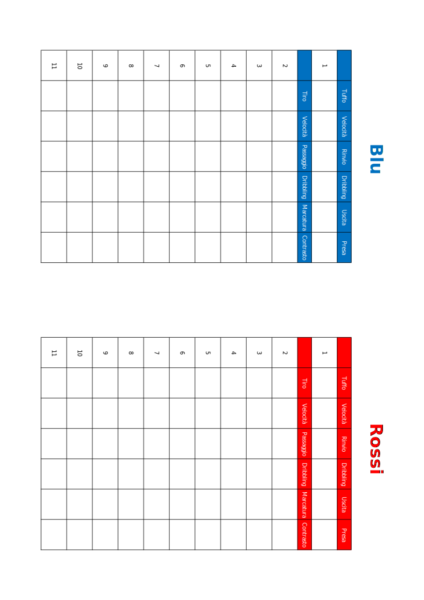

ATG Football
============

Occorrente: 1 dado a 6 facce, campo di gioco, scheda squadre, un segnalino per il pallone

Si gioca in due, ogni giocatore sceglie una squadra (rossi o blu). I giocatori concordano il numero di goal da fare per vincere la partita o il tempo entro quale concludere la partita.

Caratteristiche
---------------
Ogni calciatore (tranne il portiere) di ogni squadra ha 6 caratteristiche: Tiro, Velocità, Passaggio, Dribbling, Marcatura, Contrasto.

I portieri hanno le seguenti caratteristiche: Tuffo, Velocità, Rinvio, Dribbling, Uscita, Presa

Ogni giocatore valorizza le caratteristiche di ogni calciatore assegnando un valore da 1 a 6 a ogni caratteristica in modo che ogni caratteristica di ogni calciatore abbia un valore diverso, es:

 - Tiro: 6 
 - Velocità: 3 
 - Passaggio: 4 
 - Dribbling: 5 
 - Marcatura: 1  
 - Contrasto: 2

Capitano
--------
Ogni giocatore sceglie un calciatore come capitano della propria squadra. Il capitano aggiunge 1 ad ogni caratteristica.

Svolgimento del gioco
---------------------
Ogni giocatore imposta la propria formazione segnando la posizione di ogni calciatore negli appositi spazi sul campo di gioco.

Durante lo svolgimento del gioco, in caso di parità dopo un lancio di dadi si tira ancora.

Si tira il dado per determinare chi inizia il gioco, inizia chi ottiene il risultato più alto.

Chi inizia mette il segnalino su un centrocampista centrale.

Di seguito la squadra in possesso palla si chimerà attacco, e quella senza palla difesa

L'esito di un'azione si determina in questo modo: il calciatore in attacco tira un dado e somma la caratteristica indicata contro il calciatore in difesa che fa la stessa cosa, se l'attacco ottiene il risultato più alto ha successo, altrimenti la palla va al calciatore della difesa.

Per poter impedire un'azione il calciatore della difesa deve essere adiacente al calciatore dell'attacco.

Di seguito le azioni possibili e le relative caratteristiche in gioco:

Dribbling
---------
Per effettuare un dribbling: Dribbling contro Marcatura
Se il dribbling ha successo il calciatore può compiere un'azione come se si trovasse nella sezione davanti a quella in cui si trova, se il dribbling viene effettuato in attacco, il calciatore si trova in area.

Passaggio
---------
Per effettuare il passaggio: Passaggio contro Contrasto 
Per ricevere il passaggio: Velocità contro Marcatura

Il passaggio orizzontale, o dal potiere alla difesa ha sempre successo.

Il portiere può rinviare la palla verso un centrocampista: Rinvio contro Marcatura del centrocampista della difesa adiacente al centrocampista che riceve palla.

Un giocatore che si trova in attacco può decidere di effettuare un cross: Velocità conro Marcatura per superare il difensore e arrivare in posizione, poi Passaggio contro Contrasto per effettuare il cross. A questo punto l'attaccante tira: se il portiere esce è Velocità contro Uscita (se l'attacco vince è goal), se il portiere non esce un difensore può provare a impedite la ricezione: Velocità contro Marcatura. A questo punto se l'attaccante vince può tirare con un +1 sul tiro: Tiro contro Presa del portiere.

Tiro
----
Il tiro si può effettuare dal centrocampo, dall'attacco o in area. 

Il tiro da centrocampo è penalizzato di -2, quello da fuori area da -1, il tiro in area non ha penalità.

Il tiro dal centrocampo o dall'attacco può essere impoedito da un difensore adiacente all'attaccante (Tiro contro Contrasto) e dal portiere (Tiro contro Tuffo) in questo caso l'attaccante tira il dado una volta sola

Se l'attaccante ha eseguito un dribbling il portiere può decidere se uscire (Dribbling contro Uscita) o restare in porta (Tiro contro Presa)

Calci di rigore
---------------
In caso di parità o necessità di spareggio è possibile effettuare i calci di rigore. Ogni squadra sceglie l'elenco dei rigoristi. Il calcio di rigore si effettua come un tiro da dentro area (Tiro contro Tuffo). Il portiere però para il tiro solo se (oltre a superare il valore di tiro) il lancio di dado dell'attaccante e del portiere sono entrambi pari o entrambi dispari.

